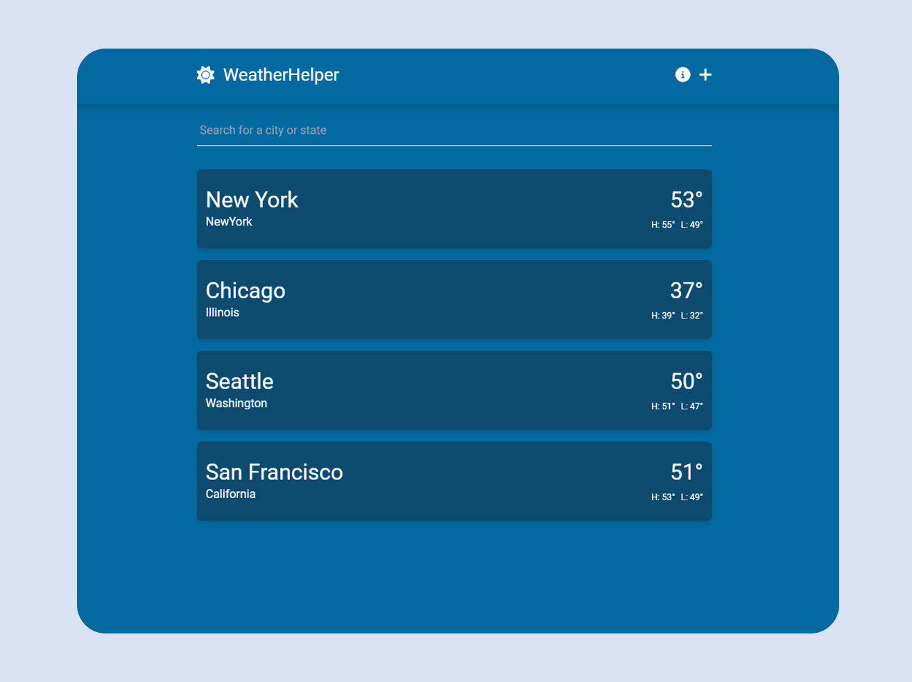

## Weather Helper

This template should help get you started developing with Vue 3 in Vite.

## Recommended IDE Setup

[Live Demo](https://cl-weatherhelper.netlify.app/)



## Project Setup

```sh
npm install
```

### Compile and Hot-Reload for Development

```sh
npm run dev
```

### Compile and Minify for Production

```sh
npm run build
```
